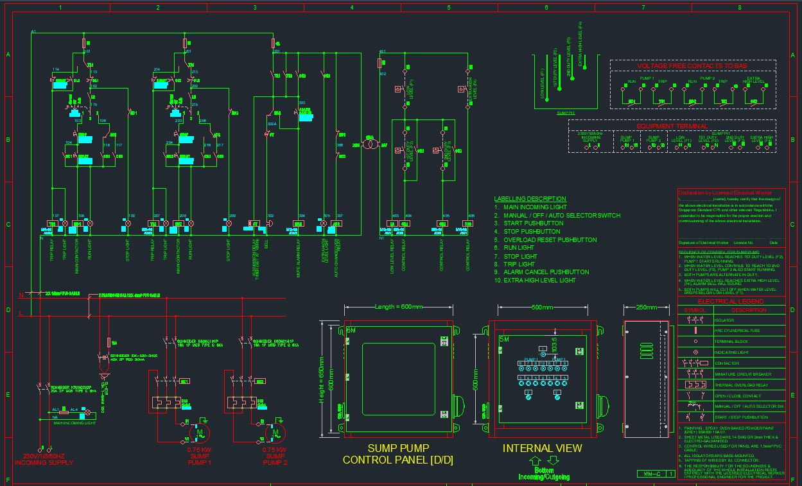

# Project Showcase 📸

---

## 🧑‍💼 About Me

**Md Imran Hossain** — Electrical Engineer  
📍 Calgary, Alberta  
✉ info.imran99@gmail.com | 📱 +1 (403) 427-8222  
[LinkedIn](https://www.linkedin.com/in/md-imran-hossain-56bb1885/)

---

## 📂 Project: (Name of Project)

> *A short one-line summary of this project — what it's doing, purpose, tech area*

### 🚀 Features / Highlights

- Feature 1: *Explain what is shown in the image (for example, a control panel layout, wiring diagram, simulation, etc.)*
- Feature 2: *Other related aspects or modules*
- Feature 3: *Any special twist or innovation*

### 🛠 Tech Stack / Tools

- Tool / Software: AutoCAD, ETAP, PLC, etc.
- Languages / Scripts (if any)
- Testing / Commissioning tools

---

## 📷 Image Description

The image above shows **(brief description of what’s in p1.JPG)** — for example:  
- The control panel interior  
- Schematic wiring connections  
- Layout or physical installation  
- Labels or instrumentation  

---

## 📈 Achievements / Benefits

- Improved system reliability  
- Enhanced visibility / diagnostics  
- Reduced downtime due to better layout  
- Easier maintenance and troubleshooting  

---

## 📁 Repository Structure

